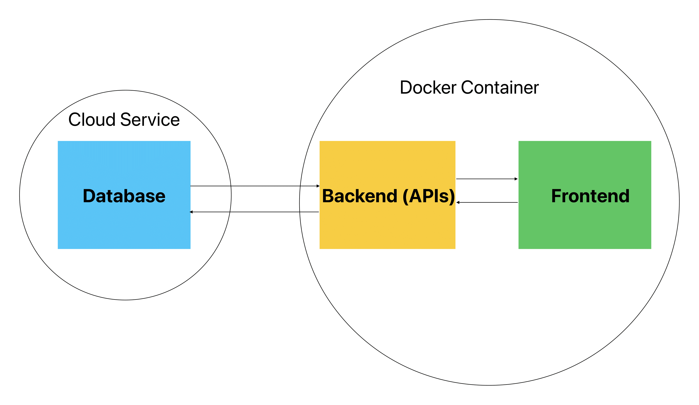
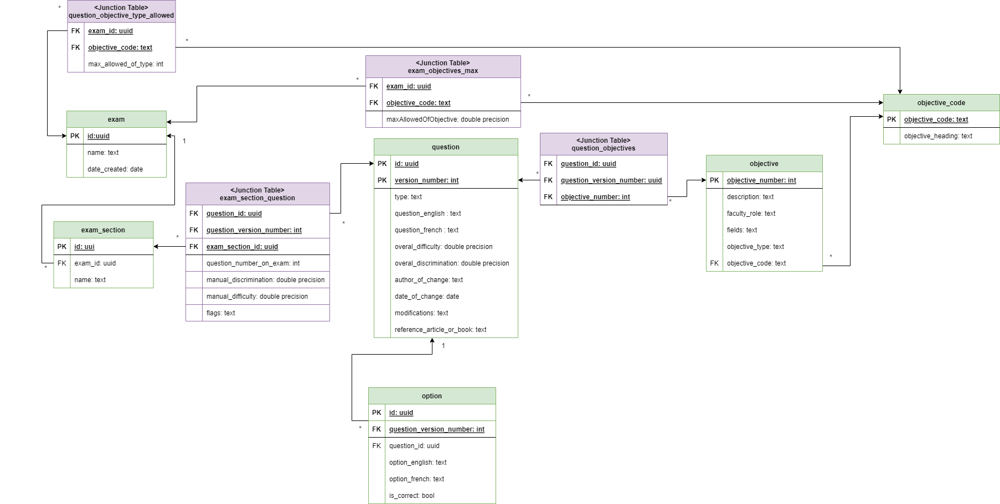

# Exam Repository
## Outline
The Undergraduate (UG) team at the Department of Family Medicine (DFM) currently has the responsibility to create exams for the medical students every 12 weeks. The UG exam questions are currently stored within an excel spreadsheet and have a number of columns that require calculations. The goal of this project is to create an accessible, password protected exam database that would allow the UG admin and directors to sort, filter, and create exams using search engines. (Eg, questions on “hypertension” or “headaches”).

As well, it is important that historical data be kept to identify what exam was given at what date and the analysis information for that exam. The database needs the ability to easily create a new exam and update current questions. The end result would be the ability to select exam questions using filters and identify exam questions used to date.

## Team members
Ricardo Saikali\
Elias Maalouf\
Joey Abonasara\
Alex Nadeau\
Stef Stella\
Michael Malek

## Objectives (benefit to customer, key things to accomplish, criteria for success)
Our objective for this project is to create a full stack web application that will allow users (UG team) to securely login to the app and sort, filter and create exams. We want to make out user interface easy to learn. Since we are dealing with a lot of data, we want to make sure our querries are efficent so that the app has a quick response time. 

## Expected/anticipated architecture
We made a database ER diagram for the database which will be updated as we discover new fields that are needed.
https://drive.google.com/file/d/1DyZWAmh6oXZfhVUVQ4WOlDL20w6N9EvR/view?usp=sharing

We also have a google docs which contains some brainstorming and notes from our meetings.
https://docs.google.com/document/d/1cUt12F4VJvl6nkrREBWfZix2Qib7idVlDigTrF9Q0LE/edit?usp=sharing


We will have our database hosted on our client's own servers. Will make a backend and a frontend which will be ran using docker on the client's computer.


This image is depicts the architecture of the database.

## Anticipated risks (engineering challenges, etc.)
1. We are note sure if we will be able to use the uottawa SSO login for security. This might mean we will need to find a different way to have a secure login.
2. Since we are dealing with a database containing secret information (med school exam questions) we need to make sure that the database is safe against malicious hackers.
3. Injecting the data in the excel files in the database. (we can write a scrpit to 
4. How to host the database (aws rds has monthly limits when it comes to usage like hours and GB used)

## Legal and social issues.
1. Since we are dealing with real exams from the Faculty of Medicine, this could mean that there are legal issues as we need to make sure the data that is given to us remains confidential. 
2. Non-disclosure agreement: do we keep the code?, do we have to give it to our client? If given for free, how long will the clients be able to use our product for free? App going beyonf the scope of the faculty of medicine? Who will maintain the application? Who pays for hosting services if needed?


## Initial plans for first release, tool setup, etc.
For our first release, we plan having minimal vial product that allows users to view and filter questions, add questions to the database and add questions to an exam. We plan on using a postgresql database hosted on AWD RDS plateform. We will use node.js to create api endpoints that will allow clients to query and modify the database. We will use react.js on the client side. 

## Task/Issue Tracking
We are using GitHub projects to track tasks/issues. Please see the project "Exam Repository" under the projects tab above.

## Goals and Requirements Spreadsheet
https://github.com/MichaelMalek001/ExamRepository/wiki/Goals-and-Requirements

## Meeting logs
https://github.com/MichaelMalek001/ExamRepository/wiki/Meeting-Logs

## Meeting Recordings
https://uottawa-my.sharepoint.com/personal/rsaik053_uottawa_ca/_layouts/15/guestaccess.aspx?folderid=0f9f0a53566d44d69a0a11b77b1ffbe26&authkey=AVCjF68A6texoxB5OeP9tK8&e=XQ1ET2

## Presentation Slides
https://github.com/MichaelMalek001/ExamRepository/blob/main/CapstonePresentation.pdf

## Running and Stopping the System Without Containers
### Frontend
```
cd frontend
npm install
npm start
```
### Backend
```
cd DatabaseBackend
gradlew build
gradlew bootRun 
``` 
If gradlew does not work try using:
```
./gradlew build
./gradlew bootRun
```
If you get failing tests, use the following command to ommit the tests:
```
gradlew build -x test
```
If you get a 404 response on all your requests to the backend you may try running the jar file that is generated after building:
```
java -jar DatabaseBackend\build\libs\DatabaseBackend-0.0.1-SNAPSHOT.jar
```
## Running and stopping the System Using Containers
### To Run
From the root directory of the repository run the following:
```
cd Databasebackend
./gradlew build
cd ..
docker-compose -f docker-compose-dev.yaml up --build
```
### To Stop
```
docker-compose down
``` 

## MkDocs Documentation
### Navigate to the Documentation Directory
```
cd Databasebackend/docs/exam-database
```
### Serve the Documentation: Run the following command to start the MkDocs server:
```
mkdocs serve
```
Viewing the Documentation: Open your web browser and go to http://127.0.0.1:8000/.
### If you want to build a static site from the documentation:
```
mkdocs build
```
The static site will be generated in the site/ directory.

## URLs
Backend: ```localhost:8080```

Frontend: ```localhost:3000```

Documentation: ```http://127.0.0.1:8000/```
